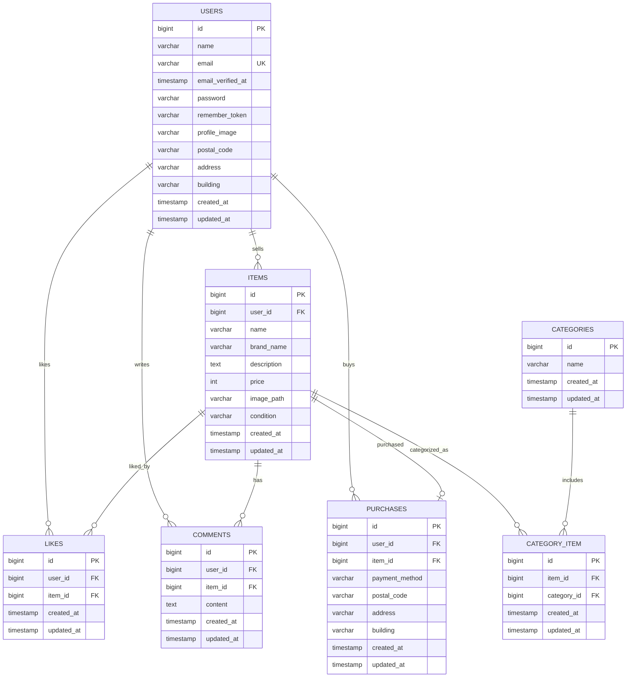
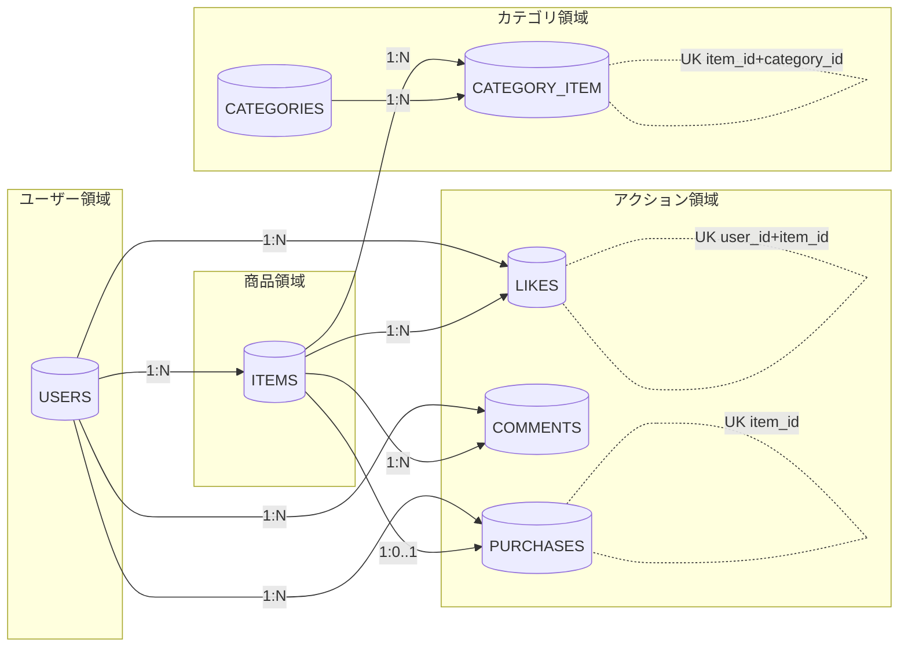
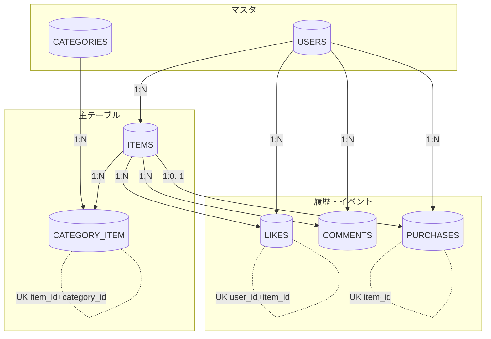

# ER図

## 制約メモ

- `users.email` はユニーク
- `likes` は `user_id + item_id` の複合ユニーク
- `category_item` は `item_id + category_id` の複合ユニーク
- `purchases.item_id` はユニーク（1商品につき購入レコードは1件）
- FK はすべて `cascadeOnDelete`

---

## ER図（レイアウト調整版）

以下は、関係の見通しを優先した配置版です。

---

## ER図（印刷版: A4縦向け）

以下は、印刷時に縦方向で追いやすい配置版です。

